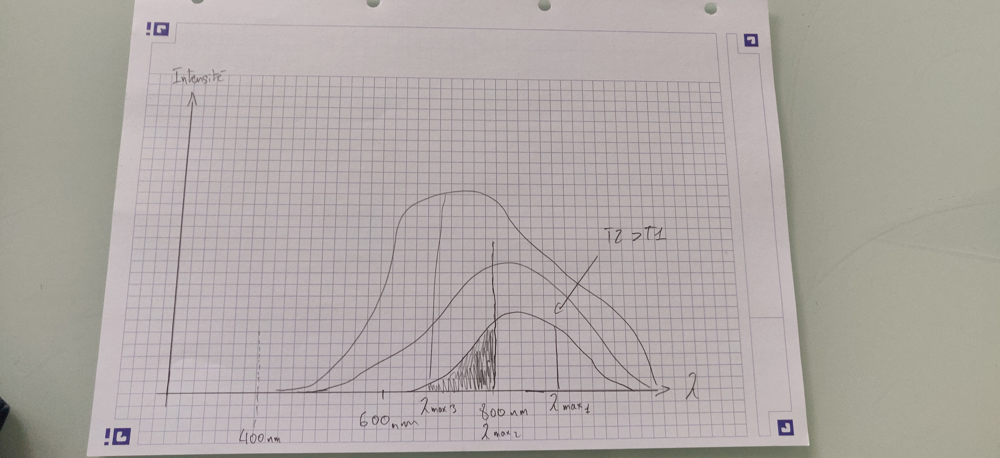

# Introduction: Rappels et déjà su/déjà vu p.66

### Constantes:

* Vitesse de la lumière dans le vide = 3.0 x $10^8$

* Vitesse du son dans l'air = 340 m/s

* Vitesse du son dans l'eau = 1500 m/s

* Vitesse du son dans les métaux = 5000 m/s
  
  <h4>Plus le milieu est condensé, plus le son se propage vite</h4>

### Lumière:

* En 1666, Newton décompose la lumière blanche grâce à un prisme (système dispersif).
* Dispersion = décomposition de la lumière blanche (polychromatique = plusieurs couleurs donc plusieurs longueurs d'onde) en radiation monochromatiques
* Lumière visible: Gamma <==== RX <==== UV <==== 400nm (bleu) à 800nm (rouge) ====> IR

Spectre continu: Uniquement obtenu avec un corps chaud => plus la température augmente (et la lumière émise), plus le spectre s'élargit vers les fortes énergie et donc les faibles longueurs d'ondes

Exemple de la lampe de Monsieur Benomar: Monsieur Benomar s'amuse avec sa lampe et remarque que plus il allume sa lampe, plus son spectre vire du rouge et orange vers le bleu et violet. On comprend que la lampe chauffe plus, émet plus de lumière et son spectre s'élargit.

Spectre de raies d'émission = raies colorées sur fond noir

#### Obtenir un spectre rayé:

On a du gaz dans une enceinte. On introduit dans cette enceinte de l'électricité. Quand celle ci entre en contact avec le gaz, elle l'excite mais celui ci n'a pas d'autre moyen de se débarrasser de cette énergie que d'émettre de la lumière. Le prisme de cette émission sera rayé (raies noires sur fond coloré) en fonction du gaz. 

#### Lumières mono ou polychromatiques

Une lumière a autant de couleurs que de raies sur son spectre.

### Électronique

Mnémotechnique: Elle Part Tranquillement 
$E = P \cdot T$ dont E = Energie, P = Puissance, T = Temps
J = W.s
ou
kWh = kW.h

Application:
Coiffeur => 5 sèche cheveux 2000W 6h par jour 312 jours/an
Engie facture le kWh 20 centimes

Cout ?

Durée = $312 \cdot 6$
Puissance = $2kW \cdot 5 = 10kW$
Energie = $18720 kWh$
Cout = 3744 €

-----

1. 
2. Spectre 3
3. Monochromatique, son spectre possède une seule raie

Mise en situation:
On rentre du boulot et on souhaite faire une ambiance tamisée et cool. On augmente progressivement la chaleur de l'ampoule et on observe:

1. Faible chaleur => le filament est rouge et la lumière n'est pas intense
2. Chaleur moyenne => le filament est orange et la lumière est plus intense

On dresse le spectre et on constate un élargissement du spectre vers les faibles longueurs d'ondes (du rouge vers le bleu) au fur et à mesure de l'augmentation de la température. 

### Synthèse des couleurs

à apprendre par cœur: 
R + V + B = Blanc
R + V = Jaune
R + B = Magenta
V + B = Cyan

Sur le graphique on constate un décollage du $\lambda$max. La surface sous la plus grande courbe augmente et est proportionnelle à l'intensité lumineuse.

## Loi de Wien:

$$ \lambda max \text{ (en m)} \cdot T \text{ (en kalvin)} = 2,898 \cdot 10^-3 \text{ (en m / k)} $$

Définition à apprendre:
La température est un moyen de mesurer la vitesse des atomes.

Exo 1 p.76:

1. Au cœur du soleil se produisent:
   
   - [ ] des réactions de fission nucléaire (quand un noyau se divise)
   
   - [x] des réactions de fusion nucléaire (quand deux noyaux deviennent un seul)
   
   - [ ] des désintégrations radioactives
   
   - [ ] des réactions chimiques

2. Au cœur des étoiles, les réactions nucléaires s'accompagnent:
   
   - [x] d'une diminution de la masse de l'étoile
   
   - [ ] d'une augmentation de la masse de l'étoile
   
   - [ ] de l'émission de rayonnements électromagnétiques
   
   - [ ] de l'absorption de rayonnements électromagnétiques

3. La loi de Wien permet de déterminer
   
   - [ ] la température d'un corps chaud <= incomplet
   
   - [x] la température d'un corps à partir de sa longueur d'onde maximale d'émission
   
   - [x] la longueur d'onde maximale d'émission d'un corps chaud 
   
   - [ ] la longueur d'onde maximale d'émission d'un corps chaud à partir de sa température 

Remarque: les réactions atomiques sont beaucoup plus puissantes que les réactions chimiques 

Exo 2 p.76:

1. Au cœur des étoiles, la température est suffisante (environ 15 M de degrés) pour que des protons puissent fusionner.

2. L'émission de lumière est proportionnelle à la surface de la source. Si la surface double alors m reçoit deux fois plus de lumière (deux fois plus de photons sont émis)

3. Quand la latitude augmente,  la puissance surfacique reçue diminue. (voir p.74)

Exo 3 p.76:

1. 

2. $$
   T = 6.8^{-7}\times2.898\cdot 10^{-3}
   $$

3. 

Interro compo:

1. De gauche à droite: gamma (rayons y), rayons x, UV, visible, Infrarouge, Micro-ondes, Ondes radio, Ondes radio longues.

2. SURTOUT NE PAS CONFONDRE: diffusion, dispersion, réflexion, réfraction.
   Réflexion : Une opération de symétrie, à deux angles 
   Réfraction : Changement de direction de la lumière au passage d'un milieu plus dense.
   Diffusion : Emission de lumière dans toutes les directions
   Dispersion : La décomposition d'une lumière polychromatique (qui a plusieurs radiations) en radiations monochromatiques. Se fait avec un système dispersif (prisme de Newton).

3. $$
   \lambda max \text{ (en m)} \cdot T \text{ (en kalvin)} = 2,898 \cdot 10^-3 \text{ (en m / k)}
   $$

4. $$
   \lambda max1\times T1 = 2,898 \cdot 10^{-3} \\
\lambda max = 650nm = 6,5 \times 10^{-7} \\
6,5 \times 10^{-7} \times T1 = 2,898\cdot10^{-3} \\
\frac{2,898\cdot10^{-3}}{6,5 \times 10^{-7}} = 4, 4584661538\cdot10^{-3} = 4458 \text{ Kalvin} = 4185^{\circ} \\
   $$

5. Loi de Stefan : Puissance surfacique (ps) = Puissance (en W) / Surface (m²)  et T une température en kelvin (cf photo tableau Analyse dimensionnelle)
   
   $$
   Ps=\sigma \cdot T^4 \\
\sigma = 5,67\cdot10^{-8}
   $$
   
   8. Loi de Stefan: $Ps=\sigma \cdot T^4$
   
   9. PS=sigma x T^4
      or lambda x T = 2,90 x10^-3, donc T=2,90 x 10^-3/lambda = 2,90x10^3/255x10^-9 = 11372,55L

Questions compo:

1. Représenter sur un axe les domaines connus des ondes électromagnétiques

2. Donner la définition du phénomène de diffusion

3. Enoncer la Loi de Wien

4. Une source lumineuse S1 

Que pouvez vous dire sur la fission nucléaire?
    La fission = désintégration d'un noyau
    Un noyau se divise
    Procédé habituel dans les centrales nucléaires
    Il existe plusieurs types de désintégrations: 

* Désintégration alpha (éjection d'un noyau d'hélium = particule alpha = ^4 He _2)
  
  * On prend de l'uranium 238 (^238 _92U) et qu'on éjecte un atome d'hélium (^4 He _2) on a du Th 234 (^234 Th _90). aux interros/evals on demandera quelle élément est le résultat d'un uranium ayant subi une désintégration alpha (réponse = Th).
  
  * Désintégration alpha du plutonium (Pu 239) = 235 ; 92 Uranium.

* Désintégration bêta ()

* Désintégration gamma ()

Que pouvez vous dire sur la fusion nucléaire?

    Fusion de deux noyaux qui en forment un seul. Beaucoup plus rare en labo, très     technique... 
    La fusion a lieu dans les étoiles
    La chaleur et la gravité sont nécessaires

QCM page 88:

- [x] La proportion de la puissance solaire parvenant à la Terre dépend du rayon de la Terre et de la distance Terre-Soleil

- [x] L'albédo correspond à la fraction de la puissance solaire réfléchie vers l'espace

- [x] L'effet de serre dépend de la présence d'une atmosphère

- [x] La température de la Terre est constante du fait d'un équilibre dynamique. Cela signifie que le sol reçoit une puissance moyenne égale à celle qu'il émet

# Comprendre que la Terre est sphérique

1. Montrer qu'au cours de l'histoire, il a été possible de construire une représentation correcte de la forme de la Terre à partir d'arguments qui ne le sont pas.
	* Les interprétations antiques ne sont pas des preuves directes de la forme de la terre
	* 0/260 = d/2*pi*r = 6300

Théories:

* Plate
* Cylindrique
* Sphérique

Arguments:

* La coque qui disparait avant le mat
* les étoiles apparaissent selon la position
* l'eclipse de la terre est une ombre circulair

## Référentiels

Un référentiel a besoin d'un point d'origine et un repère.

Lié au sol = référentiel terrestre ; a deux axes: nord-sud et est-ouest ; on utilise des méridiens et des parallèles pour se repérer dessus.

 Activité 2 p.128:
 
 1. Latitude: 48° 51' 12 N ; Longitude: 2° 20' 55 E
 2. 6152 km 
 3. ?
 4. Car le chemin le plus court est celui qui passe par la parallèle, 

# La terre dans l'univers

## Activité 1 page 152
 
Géocentrisme: placer la terre au centre

Héliocentrisme: placer le soleil au centre

Dans le modèle de Ptolémé, l’utilisation d’une rotation de la planète autour d’un point tournant lui même autour de la terre permet d’expliquer selon la position de la planète autour de ce point les mouvements de la terre.
