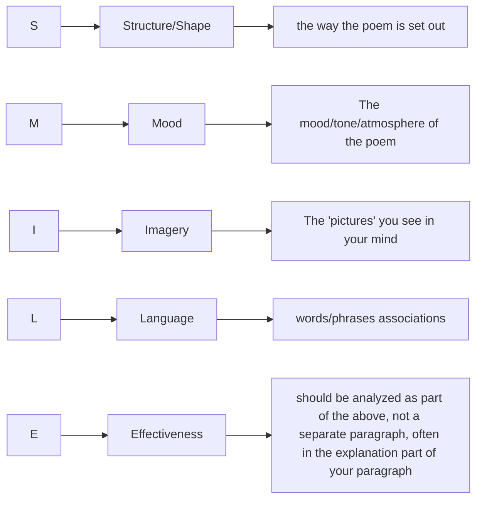

# Unseen paper

----

```mermaid
graph LR
	S --> Structure/Shape
	Structure/Shape --> X[the way the poem is set out]
	M --> Mood
	Mood --> Y[The mood/tone/atmosphere of the poem]
	I --> Imagery --> C[The 'pictures' you see in your mind]
	L --> Language --> jfdlskj[words/phrases associations]
	E --> Effectiveness --> kfljsdklf[should be analyzed as part of the above, not a separate paragraph, often in the explanation part of your paragraph]
```
<!--stackedit_data:
eyJoaXN0b3J5IjpbMTc4OTQ5Njk1OV19
-->